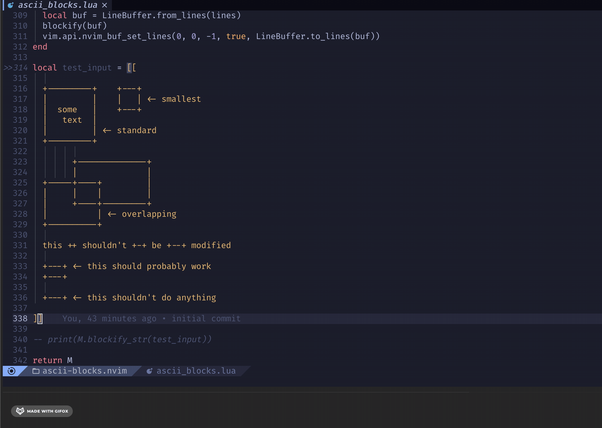

# ascii-blocks.nvim

Quickly convert ASCII boxes into more visually appealing extended UTF-8 boxes.



## Installation

Add to neovim with your favorite package manager:

```vim
Plug 'superhawk610/ascii-blocks.nvim'
```

## Usage

This plugin provides the `:AsciiBlockify` command. It will scan the current
buffer for any ASCII boxes and convert them to their UTF-8 equivalents.

## Copyright

&copy; 2022 Aaron Ross, All Rights Reserved.
